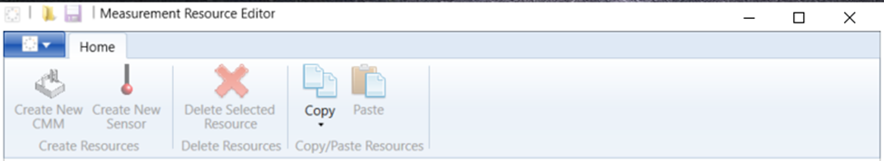
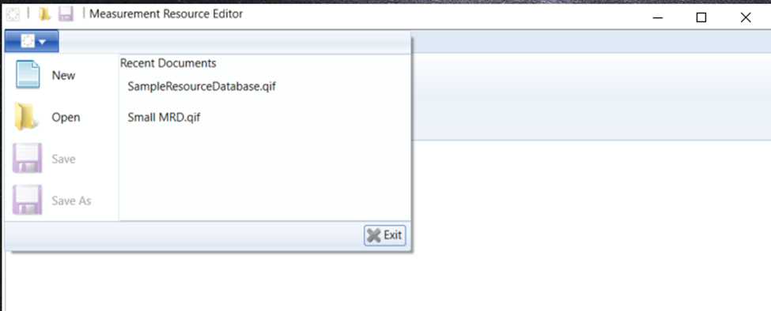
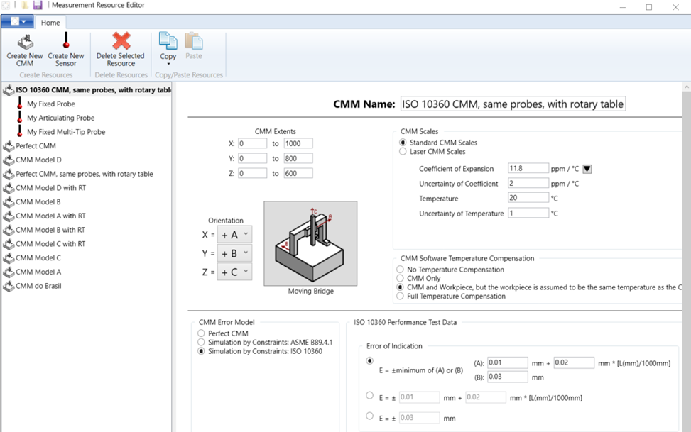
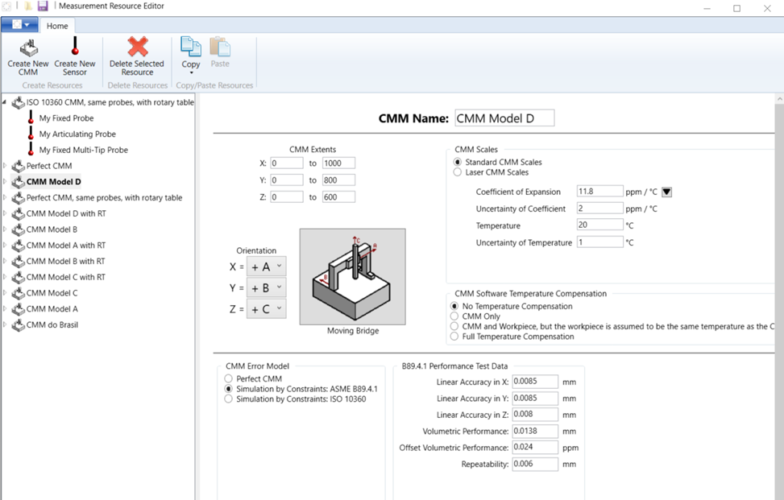
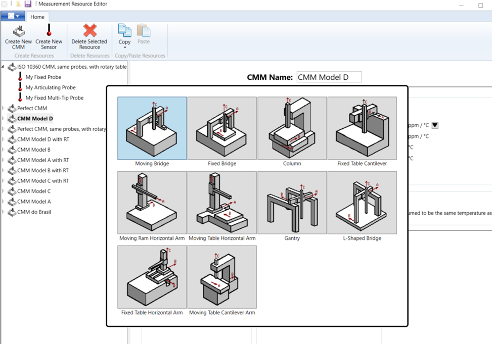
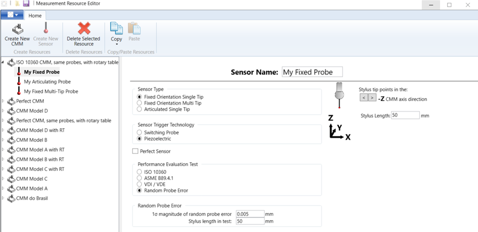
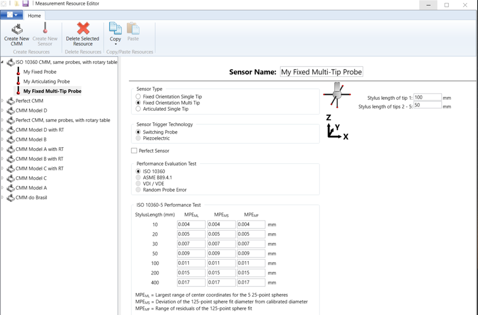
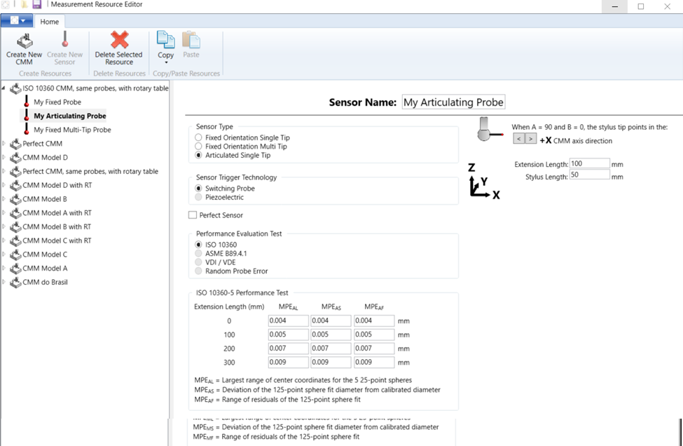
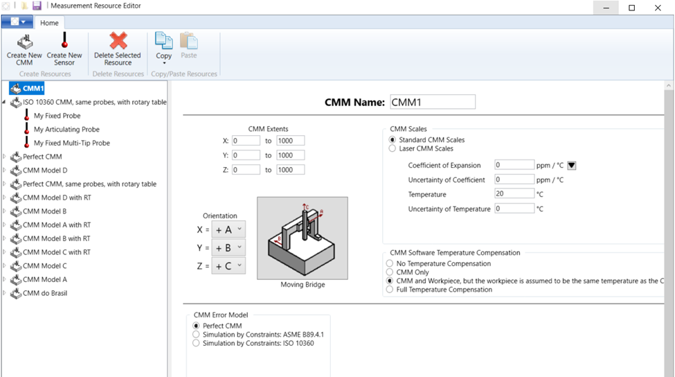
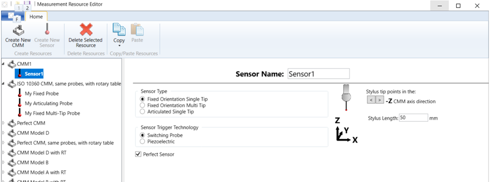

# QIF Resources Editor User's Guide

## Using the QIF Resources Editor

At startup, this Ribbon is displayed:

 
From here, a new measurement resource database (MRD) can be created or an existing one opened:

Selecting an existing MRD displays the resource tree and allows it to be edited.  Here, the data for the selected CMM and its ISO 10360 performance test is shown. 

The screen for the B89.4.1 performance test is similar.

Available CMM performance tests are: ISO 10360, ASME B89.4.1 and Perfect CMM.

The CMM geometry can be edited by clicking on the CMM image.  

 
A probe can be selected and edited by expanding the CMM item and selecting a sensor.  Here, a fixed single tip probe with a random error model is shown.  Available probe performance tests are: ISO 10360, ASME B89.4.1, VDI/VDE, random probe error and Perfect Probe.

And here is the similar screen for a multi-tip probe and the ISO 10360 performance test.

And now for an articulated probe head.

 

Other combinations of probe configuration and performance test can be selected in the same manner.

CMMs can be added to an existing or a new MRD by clicking Create New CMM.  A new CMM is added to the tree and can be edited in the manner described above.

 
With the new CMM selected, clicking on Create New Sensor allows probes to be attached to the CMM.

The completed MRD can be saved under a new or its current name.

## Custom attribute data

Some of the information that can be specified in the Measurement Resources Editor in not instantiated in the QIF 3.0 data model. This data is needed for certain software applications like [Pundit](https://www.capvidia.com/products/pundit). 

In these cases, the data has been specified in a custom Attribute. This means that the instance file is still valid to the QIF 3.0 schemas, but these attributes are not explicitly defined in either the QIF 3.0 schemas or documentation. 

The information which makes use of custom Attributes is: 

**Sensor data**

* Type of complex tactile probe sensors: multi-tip fixed, or single tip articulated.
* Technology: switching probe or articulated
* Performance tests:
    * ISO 10360
    * ASME B89
    * VDI/VDE
    * Random probe error
* Type of active performance test
* Stylus lengths
* Extension length
* A angle
* B angle
* B angle adjustment

**CMM data**

* Lower extents
* CMM temperature
* CMM temperature uncertainty 
* CMM software temperature compensation
* Active performance test. In QIF 3.0.0 files, we consider as active the first performance test from the Accuracy element of the corresponding CMM. Therefore, if no active performance test is selected, no performance test data are stored in the file.
